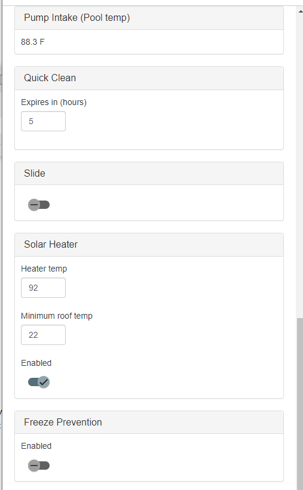
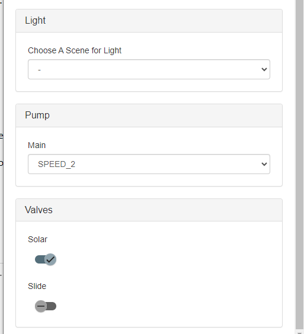

# Pool Automation
UI is mobile first and API first implementation. The backend communicates via JSON services to the UI written in Angular.

Custom schedules can be configured. You get feed back of which schedule is running and for how long. Actions can override the schedule at any time to prevent the pump or anything else from making changes.

Temperature information is updated live using server sent events from the backend. If you implement logging of the temperature you can display the information over time from all of the sensors. 

You can configure custom actions that listen for events to make decisions. Each UI component is a variable and built dynamically. Changing any value fires an event and any component can listen to the events to change the application flow. See Plugins folder for examples

If you need to override anything at any time you get access to the individual devices. This is helpful when backwashing or emptying the pump basket.

Created to run on a raspberry pi

## Local environment setup
1. Install latest version of VS Code
2. Install python version that matches the version in the Dockerfile at the top. 
    EX: FROM arm32v7/python:3.10.10-slim AS BASE 
    3.10 is the python version
3. Assuming you are on windows: In the VS Code terminal run "python -m pip install -r requirements.txt"
 If you get an error about permissions, open a terminal as admisistrator and run the install command again.
4. Add a configuration file in VS Code to execute startup.py
5. The log output should indicate where the site is hosted. It defaults to http://localhost:8080
6. Angular setup
    * Make sure node js is installed if not see: https://nodejs.org/en
    * npm install -g @angular/cli
    * cd into www
    * run "npm install"
    * To start the front end for Angular run "ng serve --open" in the terminal while in the www/ folder
### Running docker image locally
    docker run -p 8080:8080 -e 'TZ=America/Chicago' -e 'ROOT_FOLDER=/app' pool-automation:latest

All devices are stubbed out when it can't find the pi libraries.

## Docker on pi
1. Follow the directions here: https://www.simplilearn.com/tutorials/docker-tutorial/raspberry-pi-docker
2. Add your local repo as a trusted repository on both the build and destination machine: https://stackoverflow.com/questions/49674004/docker-repository-server-gave-http-response-to-https-client
### Testing on the pi with docker
#### Locally
1. docker build -f "Dockerfile" . -t "pool-automation:latest" --platform=linux/arm/v7
2. docker tag "pool-automation:latest" "192.168.1.4:5050/pool-automation:latest"
3. docker push 192.168.1.4:5050/pool-automation:latest

#### On the server
1. docker pull 192.168.1.4:5050/pool-automation:latest
2. sudo docker container rm pool-automation -f
3. With out privileged i can't get access to the temp sensors. 
sudo docker run -it -p 8080:8080 -e 'TZ=America/Chicago' -e 'ROOT_FOLDER=/app' -e 'PoolAutomationSqlConnection=*************' --device /dev/gpiomem:/dev/gpiomem -v /sys:/sys -v /dev/i2c-1:/dev/i2c-1 -v /home/pi/pool/data:/app/data --privileged --name pool-automation 192.168.1.4:5050/pool-automation:latest

##### Troubleshooting 
* Viewing logs
    docker logs pool-automation
    Set the environment variable ENV_LOG_SERVER_NAME and ENV_LOG_SERVER_PORT to send logs to a sys log server.
* Restart container
    docker restart pool-automation
* Remove old images
    docker image prune

## Authentication
No security is provided, but I used my synology nas to help me out here. I already have a certificate installed on it. The NAS also provides an option for reverse proxy, but it doesn't include authentication. I found a docker container project that provides the LDAP authentication. With the two, i piped traffice from one proxy to another. I could just use the Docker container, but then I would have to manage the cert in two places. This is a set it and forget it solution.

### Synology Reverse Proxy
I used Synology Application proxy to manage HTTPS and configured it to point to it's self 8081.
You can read about how to configure it here: https://mariushosting.com/synology-how-to-use-reverse-proxy/
1. Source
    * protocol HTTPS
    * hostname: {YouNasServerName}
    * Port: {Port you want to expose on the server}
2. Destination
    * Protocol: HTTP
    * Hostname: {YouNasServerName}
    * Port: {The port number you are going to use in the container}

### Docker Container in Synology for LDAP authentication
reverse proxy container using: https://hub.docker.com/r/dariko/httpd-rproxy-ldap/

Set the following configuration for the container:
1. Initial screen
    * Set resource limitation to 256MB
2. Go to advanced settings
    1. Enabled auto-restart
    2. Network - choose "Use the same network as Docker Host"
    3. Port Settings - Container port 8081
    4. Environment
        * LDAP_URI=ldap://{DomainName.com}/dc={DomainName},dc=com?uid?sub?(objectClass=*)
        * PROXY_URI=http://{YourPi}:8080/
        * LISTEN_PORT=8081
        * SERVERNAME={YouNasServerName}    
